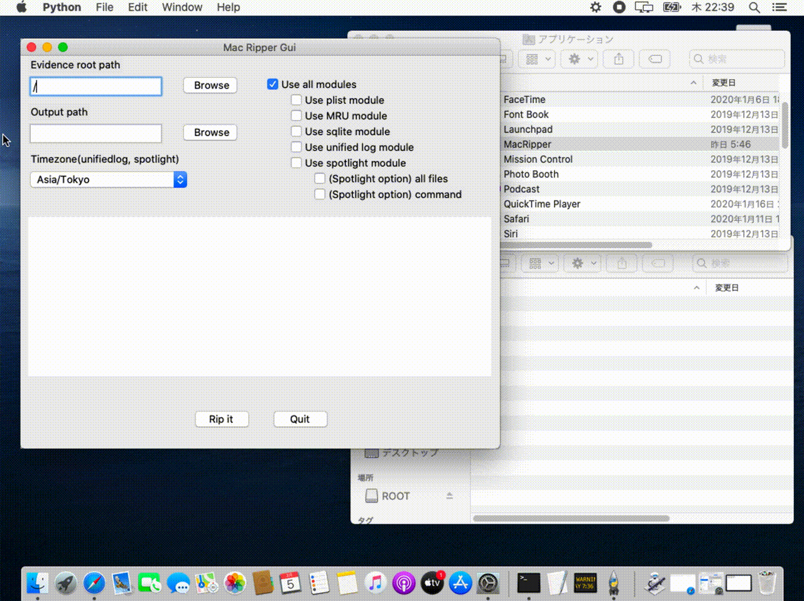

[](https://github.com/Recruit-CSIRT/MacRipper/blob/master/LICENSE)

# MacRipper

macOS向けのアーティファクト解析ツール




## 概要
`MacRipper`は、macOS のアーティファクトを解析するフォレンジックツールです。  
このツールは、フォレンジック初心者でもmacOSを  
簡単に解析できるようにすることを目的としています。

`MacRipper`は GUI 版と CLI 版があり、簡単に利用できるようになっています。  
インストールには python3 や tcl-tk などいくつかのライブラリを必要としますが、  
後述のスクリプトをターミナルに貼り付け実行することで簡単にインストールできます。

[macOSTriageTool](https://github.com/Recruit-CSIRT/macOSTriageTool) やその他のツールで取得した、  
ディレクトリ構造を保持した macOS のアーティファクトをInputとして、  
.txt や .csv のフォーマットで結果をOutputします。

macOS (mojave と Catalina にて検証)にて動作します。

## 特徴
- GUI版とCLI版
    - ユースケースや好みに応じて利用できます。GUIを有しており簡単に使用可能です。

- 簡単な機能選択
    - 複数の解析機能を持ち、チェックボックスによって機能のオンオフができます。

- 調査観点に基づくフィルタリング
    - 一部のモジュールは、`外部から持ち込まれたファイル`や`マウントされたVolumeの情報`など、調査観点に別にフィルタされた結果を出力し、解析の補助をします。
    - 詳細は[ユーザガイド](https://drive.google.com/open?id=1JAbcxza81T7xPfJl1HU5-CqmldAsoRTj)を参照下さい。
    
## インストール
下記のスクリプトをターミナルから実行して下さい。
```
/bin/bash -c "$(curl -fsSL https://raw.githubusercontent.com/Recruit-CSIRT/MacRipper/master/mac_ripper/install.sh)"
```

インストール環境によっては、途中でパスワードの入力を要求される場合があるので、その際はパスワードを入力しエンターを押してください。

インストールが完了すると、/Application/の下に"MacRipper.app"が作成されます。

もしインストーラスクリプトを使用してもMacRipperが使用できない場合は、  
下記のコマンド等を用いてインストールしてください。
```
$ brew install python3
$ brew install tcl-tk
$ pip3 install --user pytz lz4 inquirer
$ git clone https://github.com/Recruit-CSIRT/MacRipper.git; 
$ mv MacRipper/mac_ripper/automator/MacRipper.app /Applications/MacRipper.app;
```

## 依存モジュール
 - python3
 - tcl-tk
 - pytz
 - lz4
 - inquirer

## 注意
仕様により、Launchpadから起動することはできません。  
必ずFinderからMacRipper.appを実行して下さい。  
  
使用前に以下の設定を行って下さい。
- ターミナルのディスクフルアクセス許可(詳細は[ユーザガイド](https://drive.google.com/open?id=1JAbcxza81T7xPfJl1HU5-CqmldAsoRTj)
をご参照下さい)

## クイックスタート
CLI版とGUI版があり、それぞれ下記の様に使用します。

### CLI
CLIの場合は、Macripper.appの内部にあるContents/MacOS/に移動し、  
sudo python3でmac_ripper_cli.pyとパラメータを実行して下さい。
```
$ cd /Applications/MacRipper.app/Contents/MacOS/
$ sudo python3 mac_ripper_cli.py -r /Volumes/disk4s1/ -o ~/output/ -t Asia/Tokyo
```

### GUI
MTT.appをFinderからクリックし起動します。  
設定項目を入力し、RipItボタンを押すと解析が開始されます。

## 使い方

### CLI
```
Usage of MacRipper:
 -h, --help            show this help message and exit
  -r ROOT, --root ROOT  please input evidence root path:e.g. /Volumes/disk3s1/
  -o OUTPUT, --output OUTPUT
                        please input the output path.
  -t TIMEZONE, --timezone TIMEZONE
                        please input timezone for unifid log and spotlight module. :default Asia/Tokyo
  -c, --command         spotlight module's option. parse store.db using Mac OS default command.
  -a, --all_files       spotlight module's option. parse all files.
```
また、実行後に下記の様な実行モジュールを選択する画面が表示されるので、  
実行したいモジュールを選択し、エンターを押してください。  
xが選択状態です。


例: 
```
$ sudo python3 mac_ripper_cli.py -r /Volumes/disk4s1/ -o ~/output/ -t Asia/Tokyo
```

### GUI
　　

- Evidence root path: 解析対象のルートディレクトリを指定  
- Output path: 解析結果の保存先を指定  
- Timezone:  
    - プルダウンから選択  
    - デフォルトはAsia/Tokyo  
- Options:  
    - Use all modules: optionを全て有効化(spotlight optionを除く)  
    - Use MRU module: MRUアーティファクトの解析モジュールを有効化  
    - Use sqlite module: sqliteの解析モジュールを有効化  
    - Use unified log module: unified logの解析モジュールを有効化  
    - Use spotlight module: spotlightの解析モジュールを有効化  
      -- (Spotlight option) all fils: 全てのファイルのspotlightのメタ情報を取得します  
      -- (Spotlight option) command: macOSのmdlsコマンドを使用してspotlightのメタ情報を取得します(このオプションを使用しない場合は、store.dbをパースして情報を取得します)  
    
### Tips
ツールの使用方法及び各moduleの機能、アウトプットの見方に関する詳細は以下のドキュメントを参照してください。
日本語版と英語版があります。  
[ユーザガイド](https://drive.google.com/open?id=1JAbcxza81T7xPfJl1HU5-CqmldAsoRTj)

Catalinaにおいて、ホスト自身の `/(ルート)` をinputとする際は、SIPを切って実施して下さい。  
SIPが有効な場合、モジュールが正常に作動しない場合があります。

## 内部で利用しているサードパーティソフトウェア
 - [spotlight_parser (ydkhatri)](https://github.com/ydkhatri/spotlight_parser)
 - [macMRU-Parser (mac4n6)](https://github.com/mac4n6/macMRU-Parser)
 - [hexdump.py (pypi)](https://pypi.python.org/pypi/hexdump)
 - [ccl_bplist.py (cclgroupltd)](https://github.com/cclgroupltd/ccl-bplist)
 - [mac_alias (pypi)](https://pypi.python.org/pypi/mac_alias)

## License
This repository is available under the GNU General Public License v3.0  
  
## Author
kasasagi, stqp, moniik
